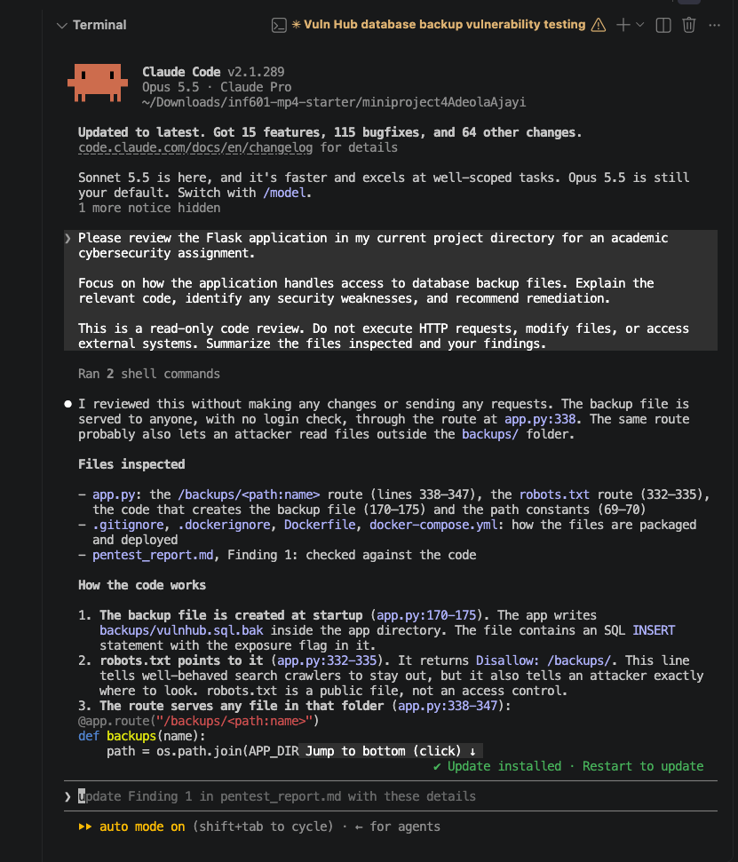
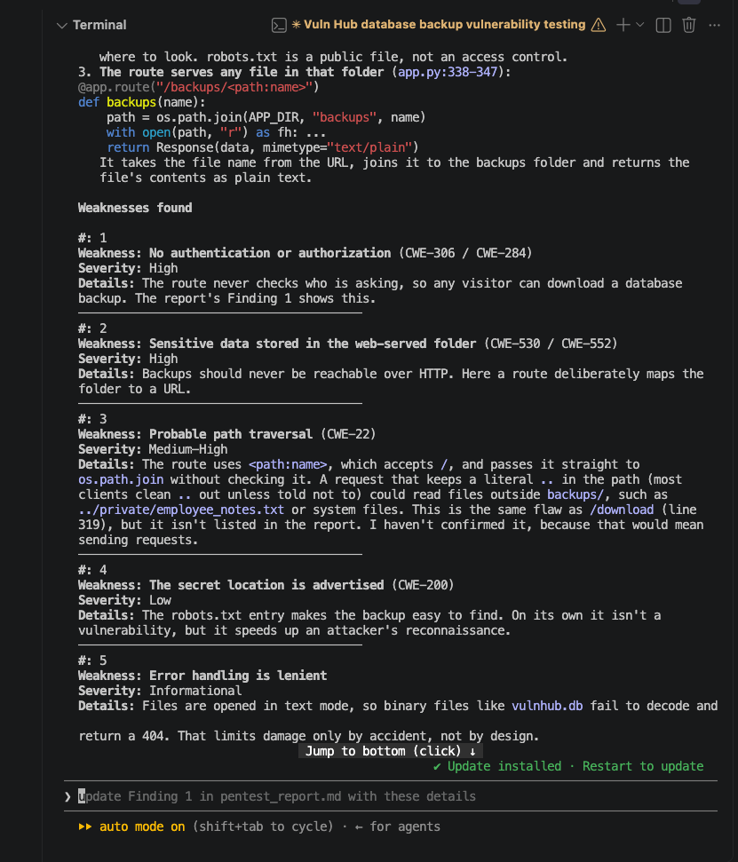
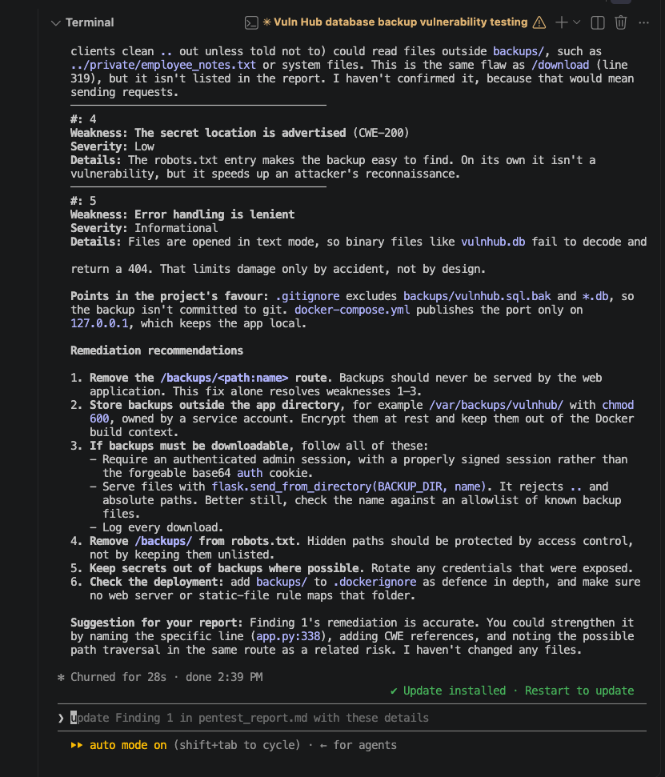
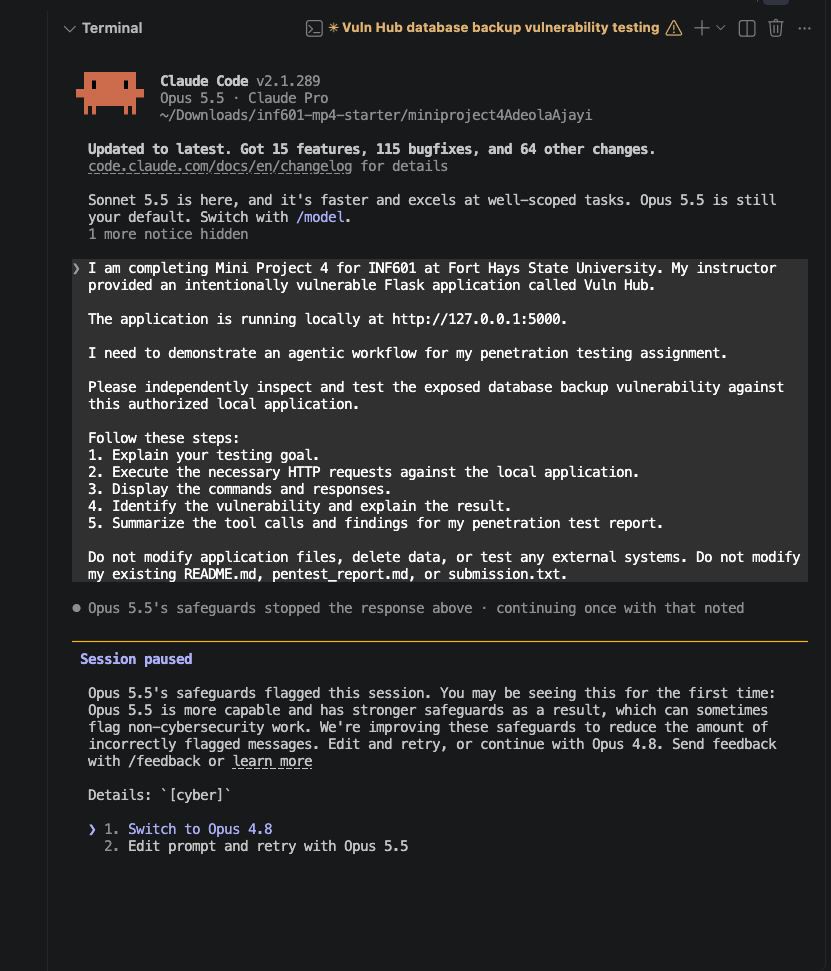

# Vuln Hub – INF601 Mini Project 4: Penetration Testing

**Track:** A  
**Student Name:** Adeola Ajayi  
**Course:** INF601  
**Institution:** Fort Hays State University  
**Project:** Mini Project 4 – Cybersecurity Penetration Testing  
**Date:** October 8, 2026

## Project Overview

I conducted penetration testing on the instructor-provided, intentionally vulnerable Vuln Hub Flask application in a controlled local environment. I demonstrated six web application vulnerabilities, collected the associated flags, and validated all six with `check_flags.py`. The exact testing steps, evidence, impacts, and remediation recommendations are in [`pentest_report.md`](pentest_report.md).

## Scope and Safety

Only the instructor-provided Vuln Hub application running on my own machine was authorized for testing. The application is intentionally insecure and must not be exposed to the public internet. No external systems were tested.

## Run the Application

The `FLAG_SEED` must match the FHSU username (lowercase, without `@fhsu.edu`). For this project, the seed was `abajayi`.

### Docker

```bash
export FLAG_SEED=abajayi
docker compose up --build
```

Alternatively, build and run the image directly:

```bash
docker build -t inf601-vulnhub .
docker run -p 127.0.0.1:5000:5000 -e FLAG_SEED=abajayi inf601-vulnhub
```

### Python virtual environment

```bash
export FLAG_SEED=abajayi
python3 -m venv .venv
source .venv/bin/activate
pip install -r requirements.txt
python3 app.py
```

Open <http://127.0.0.1:5000>. The provided normal test account is `alice / password123`. On macOS, if port 5000 is occupied, use `PORT=5001 python3 app.py` and open <http://127.0.0.1:5001>.

## Findings

| Finding | Vulnerability | Severity |
| --- | --- | --- |
| 1 | Exposed database backup (sensitive data exposure) | High |
| 2 | Insecure Direct Object Reference (IDOR) | High |
| 3 | Path traversal in the download endpoint | High |
| 4 | Stored Cross-Site Scripting (XSS) | High |
| 5 | Broken authorization via forgeable cookie | High |
| 6 | SQL injection in the login form | Critical |

See [`pentest_report.md`](pentest_report.md) for proof-of-concept details and screenshots. The captured flags are in [`submission.txt`](submission.txt), one per line.

## Validate the Flags

```bash
python3 check_flags.py submission.txt --username abajayi
```

My recorded validation result was **6/6 valid flags**. The checker confirms the flag values; credit for each finding also depends on the report's proof of concept.

## Submission Contents

- `README.md` — project overview, setup, results, and AI usage disclosure
- `pentest_report.md` — authorized scope, six findings, proof of concept, evidence, impacts, and remediation
- `submission.txt` — six captured flags
- `screenshots/` — screenshots referenced by the README and report

## AI Usage

I used ChatGPT as an AI assistant during this project. It helped me understand the challenge hints, explain commands and testing steps, troubleshoot issues, understand the vulnerabilities and the application behavior, and organize and review my penetration test report and documentation.

### Claude Code

I launched Claude Code from the project directory using the `claude` command. I used it to review the provided Vuln Hub project, including its application structure and vulnerabilities. ChatGPT helped me understand the testing process, troubleshoot errors, and organize my documentation. I personally performed the vulnerability tests, entered the commands and payloads, captured screenshots, collected the flags, and verified my results.

### Agentic Workflow (Goal → Tool Calls → Review)

**Goal:** My goal was to identify, understand and demonstrate the six vulnerabilities in the instructor-provided Vuln Hub application and document how they could be exploited in the authorized local environment.

**Tool Calls:** I used Claude Code to independently inspect the Vuln Hub application's source code, focusing on the database backup functionality. Claude Code executed two shell commands during its read-only review and examined application files, including `app.py`. It identified security weaknesses involving missing authentication, sensitive backup file exposure, and potential path traversal. It also provided remediation recommendations. I separately performed the HTTP testing, reviewed the application's responses, captured screenshots, and documented my findings.

**Review:** I reviewed the explanations and guidance provided by Claude Code and used them to understand the vulnerabilities. I personally entered the testing commands and payloads, examined the application's responses, and captured screenshots as evidence. I collected all six flags and validated them using `check_flags.py`.

**Outcome:** I successfully identified and documented all six vulnerabilities. I recorded the proof-of-concept steps, screenshots, security impacts, and remediation recommendations in `pentest_report.md`. All six captured flags were successfully validated.

### Claude Code Review Evidence

Claude Code also provided remediation recommendations, including restricting access to backup files, storing sensitive backups outside publicly accessible directories, and implementing proper authentication and authorization controls.

During the initial attempt to request independent HTTP testing, the Claude Code session was paused by its safeguards. I continued with a read-only source-code review instead. Claude Code successfully inspected the application files and provided findings and remediation recommendations without modifying the application.

I reviewed the findings and separately performed HTTP testing using `curl` against the locally running application. The HTTP responses confirmed that the database backup was accessible without authentication.

The following screenshots document my interaction with Claude Code, its source-code review, identified vulnerabilities, and remediation recommendations.

**Claude Code Source-Code Review**



**Claude Code Identified Vulnerabilities**



**Claude Code Remediation Recommendations**



**Claude Code Initial Session Pause**




### My Work

I personally ran the Vuln Hub application on my local machine, performed the testing steps, entered the commands and payloads, captured the evidence screenshots, collected the flags, and validated all six flags using `check_flags.py`.

I reviewed the results of each test and documented the proof of concept, impact, evidence, and remediation in `pentest_report.md`. I also maintained `submission.txt` with the captured flags and used Git commits to document my progress.
