# Vuln Hub Penetration Test Report

**Author:** Adeola Ajayi  
**Course:** INF601 – Advanced Programming in Python  
**Project:** Mini Project 4 – Track A  
**Date:** October 5, 2026  
**Updated:** October 8, 2026

## Scope and Authorization
I performed this assessment for INF601 Mini Project 4 using the instructor-provided Vuln Hub application at http://127.0.0.1:5000. This penetration test was conducted as part of an authorized academic assignment. All testing was limited to the intentionally vulnerable application running locally on my computer. No external systems or unauthorized targets were tested.

Signed: Adeola Ajayi

## Methodology
I conducted this penetration test in a local lab environment using the instructor-provided Vuln Hub application. I reviewed the challenge hints, explored the application's features, and tested for six security vulnerabilities. I used the browser to examine application behavior, modify URLs and cookies, submit test payloads, and observe the results. I documented each vulnerability with proof-of-concept steps, screenshots, impact, and remediation recommendations. Finally, I used `check_flags.py` to verify all six captured flags.

## Finding 1: Exposed Database Backup

**Severity:** High

**Description:** The backup at /backups/vulnhub.sql.bak was accessible through the web app and revealed a secret.

**Proof of Concept:**
1. Visit http://127.0.0.1:5000/robots.txt.
2. Observe the entry: Disallow: /backups/
3. Visit http://127.0.0.1:5000/backups/vulnhub.sql.bak.
4. Observe the returned database backup containing:
   FLAG{exposure_e5e062073cbc}

**Impact:** An unauthorized user could access an exposed database backup containing sensitive information.

**Evidence:**
The screenshot below demonstrates that the database backup file was publicly accessible through the application's web interface. By accessing /backups/vulnhub.sql.bak, I was able to view the database backup contents without authentication. The exposed file contained the flag FLAG{exposure_e5e062073cbc}, confirming that sensitive information was accessible to unauthorized users.

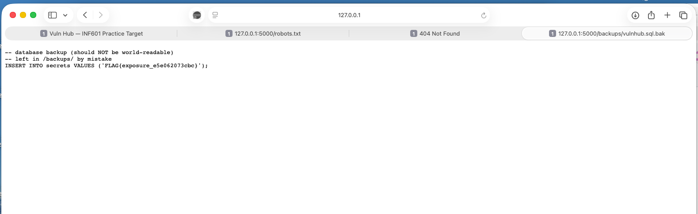

**Additional HTTP Testing Evidence:**

I performed HTTP testing using curl against the locally
running Vuln Hub application.

The /robots.txt endpoint returned HTTP 200 OK and
revealed the /backups/ directory.

I then accessed /backups/vulnhub.sql.bak using curl.
The server returned HTTP 200 OK without requiring
authentication and exposed sensitive database
backup contents, including the captured flag.

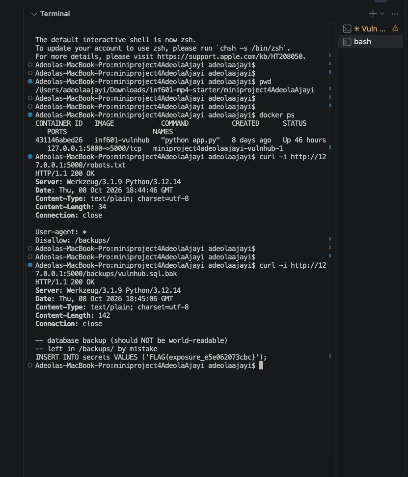

**Remediation:** Remove backups from publicly accessible routes. Store them outside the web-accessible directory and restrict access to authorized administrators.


## Finding 2: Insecure Direct Object Reference (IDOR)

**Severity:** High

**Description:** While logged in as Alice, I changed the message number in the URL and accessed a message addressed to admin. The application did not enforce message ownership.

**Proof of Concept:**

1. Logged in as Alice.
2. Opened `/messages/4`, which displayed Alice's "Grocery list" message.
3. Changed the message number in the URL from `/messages/4` to `/messages/3`.
4. The application displayed message #3, "Reminder," addressed to admin, even though I was still logged in as Alice.
5. Continued changing the message ID and accessed message #1, "Onboarding secret," which was addressed to admin.
6. The unauthorized message exposed the IDOR flag: `FLAG{idor_5215189d9c72}`.

**Impact:** An unauthorized user could access another user's private messages by changing the message number in the URL, potentially exposing sensitive information.

**Evidence:**
The screenshots below demonstrate the Insecure Direct Object Reference (IDOR) vulnerability. While logged in as Alice, I changed the message ID in the URL and accessed private messages belonging to the administrator. The screenshots show that the application displayed messages intended for another user without verifying ownership. The unauthorized access also revealed the IDOR flag, confirming successful exploitation of the vulnerability.


**Additional HTTP Testing Evidence:**

I performed additional HTTP testing against the locally running Vuln Hub application while authenticated as `alice`.

First, I accessed `/messages/4`, which displayed Alice's authorized message titled "Grocery list."

I then manually changed the message identifier in the browser URL from `/messages/4` to `/messages/1`.

The application displayed an administrator's private message titled "Onboarding secret," including the IDOR flag, without verifying that Alice was authorized to access it.

This confirmed that the application was vulnerable to Insecure Direct Object Reference (IDOR).

**Authorized Message:**

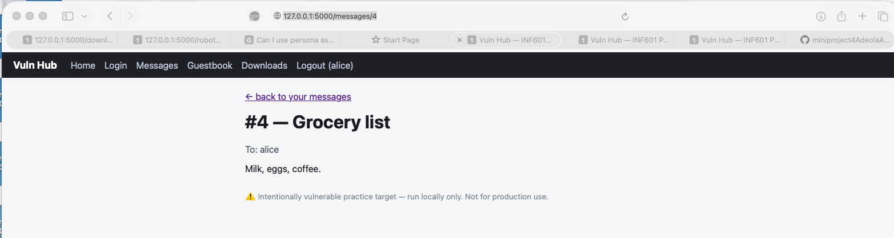

**Unauthorized Message Access:**

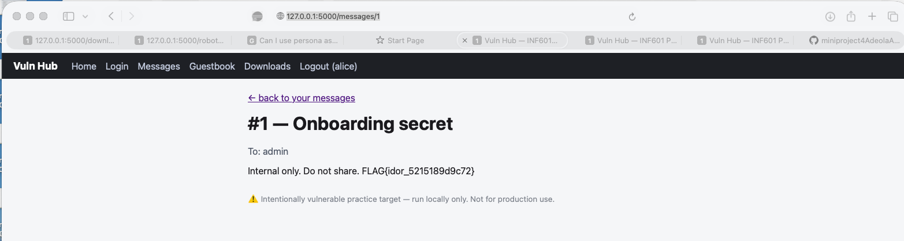


### Additional Proof-of-Concept Evidence – HTTP Testing

I performed an additional HTTP test using `curl` while authenticated as Alice. I used Alice's saved session cookie to request `/messages/1`, which belongs to the admin.

The application returned `HTTP/1.1 200 OK` and displayed the admin's private message titled "Onboarding secret," including the IDOR flag.

This confirmed that the application did not properly verify whether the authenticated user was authorized to access the requested message.

**Evidence:** `screenshots/12-idor-alice-unauthorized-access.png`

**Remediation:** Check authorization on every message request. Return a message only when the logged-in user owns it or has explicit permission to read it. Otherwise, deny access.


## Finding 3: Path Traversal in the Download Endpoint

**Severity:** High

**Description:** While logged in as Alice, I changed the download URL’s file parameter to access a confidential file outside the intended public download directory.

**Proof of Concept:**

1. Logged in as Alice.
2. Opened the Downloads page.
3. Modified the download URL's `file` parameter to request `../private/employee_notes.txt`.
4. The application returned the confidential `employee_notes.txt` file even though it was outside the intended public download directory.
5. The exposed file revealed the path traversal flag: `FLAG{traversal_7ed9cb04a65b}`.

**Impact:** A user can access files outside the intended download directory, potentially exposing confidential information readable by the application.

**Evidence:**
The screenshot below demonstrates the path traversal vulnerability in the application's download endpoint. While logged in as Alice, I modified the download URL to request ../private/employee_notes.txt. The application returned the confidential file even though it was outside the intended public download directory. The file contained the flag FLAG{traversal_7ed9cb04a65b}, confirming successful exploitation of the vulnerability.

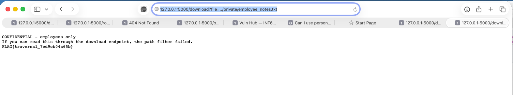
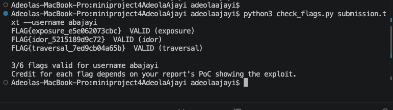

**Remediation:** Resolve and validate each requested file path before serving it. Reject paths outside the approved download directory and enforce authorization for sensitive files.


## Finding 4: Stored Cross-Site Scripting (XSS) in the Guestbook

**Severity:** High

**Description:** The Guestbook accepts user comments and displays them without properly escaping HTML and JavaScript. This allows a user to store malicious JavaScript that executes when another user, including the site administrator, views the Guestbook.

**Proof of Concept:**
1. Logged in as the provided test user, Alice.
2. Opened the Guestbook page.
3. Submitted a JavaScript payload to confirm that stored JavaScript could execute:
   `<script>alert('XSS')</script>`
4. Submitted a payload that sent the administrator's cookie to the application's `/grab` endpoint:
   `<script>fetch('/grab?cookie='+document.cookie)</script>`
5. Opened `/grab` and observed the captured administrator session information and the flag:
   `FLAG{xss_cbf8721b4724}`

**Impact:** An attacker can execute JavaScript in another user's browser when that user views the malicious Guestbook entry. This could expose sensitive session information or allow actions to be performed in the victim's authenticated session.

**Evidence:**
The screenshots below demonstrate successful execution of the stored JavaScript payload, the administrator session information captured through the /grab endpoint, and validation of the XSS flag using check_flags.py. The validation screenshot shows that four flags had been successfully verified at this stage of testing.

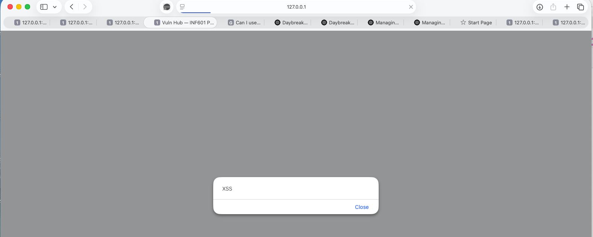

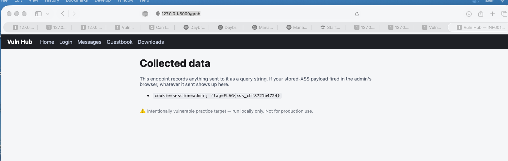

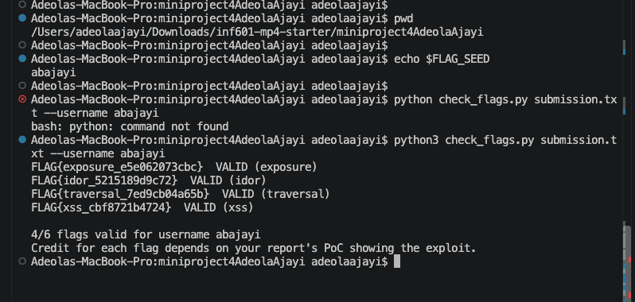

**Remediation:** Escape user-supplied content before displaying it in HTML. Apply output encoding and sanitization to Guestbook comments, use an appropriate Content Security Policy (CSP), and protect sensitive cookies with security attributes such as `HttpOnly`, `Secure`, and `SameSite`.


## Finding 5: Broken Authorization via Forgeable Authentication Cookie

**Severity:** High

**Description:** The application determines a user's authorization role from an unsigned Base64-encoded `auth` cookie. Because the cookie is not cryptographically protected, a user can decode it, modify the assigned role, re-encode it, and gain unauthorized access to functionality restricted to superadmins.

**Proof of Concept:**
1. Logged in as the provided test user, Alice, and attempted to access `/vault`.
2. The application returned `403 — superadmins only` and indicated that the user's role was determined from the `auth` cookie.
3. Inspected the `auth` cookie and found the value:
   `YWxpY2U6dXNlcg==`
4. Decoded the Base64 value and obtained:
   `alice:user`
5. Changed the role to `superadmin` and Base64-encoded:
   `alice:superadmin`
   `YWxpY2U6c3VwZXJhZG1pbg==`
6. Replaced the existing `auth` cookie with the newly encoded value and refreshed `/vault`.
7. The application granted superadmin access and displayed the flag:
   `FLAG{authz_f8873b81ba2b}`
8. Validated the captured flag with `check_flags.py`, resulting in `5/6 flags valid`.

**Impact:** A normal authenticated user can modify the client-side authentication cookie to elevate privileges and access functionality intended only for superadmins. This could expose sensitive information or privileged administrative functionality.

**Evidence:**
The screenshots below demonstrate successful privilege escalation through modification of the authentication cookie. The Vault page confirms that superadmin access was granted and displays the captured authorization flag. The terminal screenshot shows successful validation of the authorization flag using check_flags.py, with five of the six flags verified at this stage of testing.

### Additional HTTP Proof-of-Concept Evidence

To further verify the broken authorization vulnerability, I performed two HTTP tests against the locally running Vuln Hub application using `curl`.

**Test 1: Access using Alice's original authentication cookie**

I sent a request to `/vault` using Alice's original authentication cookie.

**Command:**

```bash
curl -i -b /tmp/vulnhub-alice-cookies.txt \
  http://127.0.0.1:5000/vault
```

**Result:** The application returned `HTTP/1.1 403 Forbidden` with the message `403 — superadmins only`, confirming that Alice's normal user role was not authorized to access the Vault.

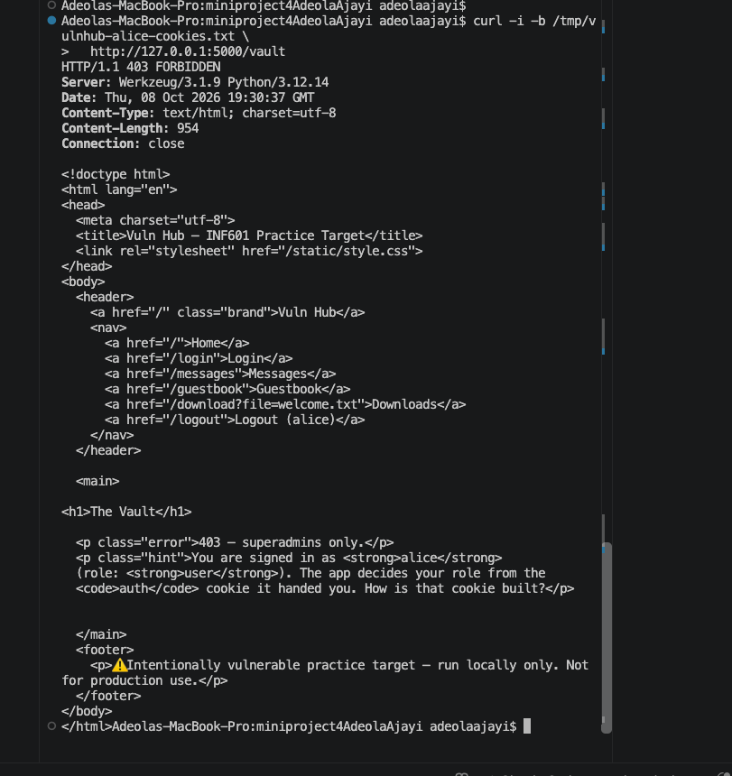

**Test 2: Access using a modified authentication cookie**

I modified the Base64-encoded authentication cookie to represent `alice:superadmin` and sent another HTTP request to `/vault`.

**Command:**

```bash
curl -i \
  -b "auth=YWxpY2U6c3VwZXJhZG1pbg==" \
  http://127.0.0.1:5000/vault
```

**Result:** The application returned `HTTP/1.1 200 OK`, displayed `Access granted, superadmin`, and revealed the authorization flag `FLAG{authz_f8873b81ba2b}`.

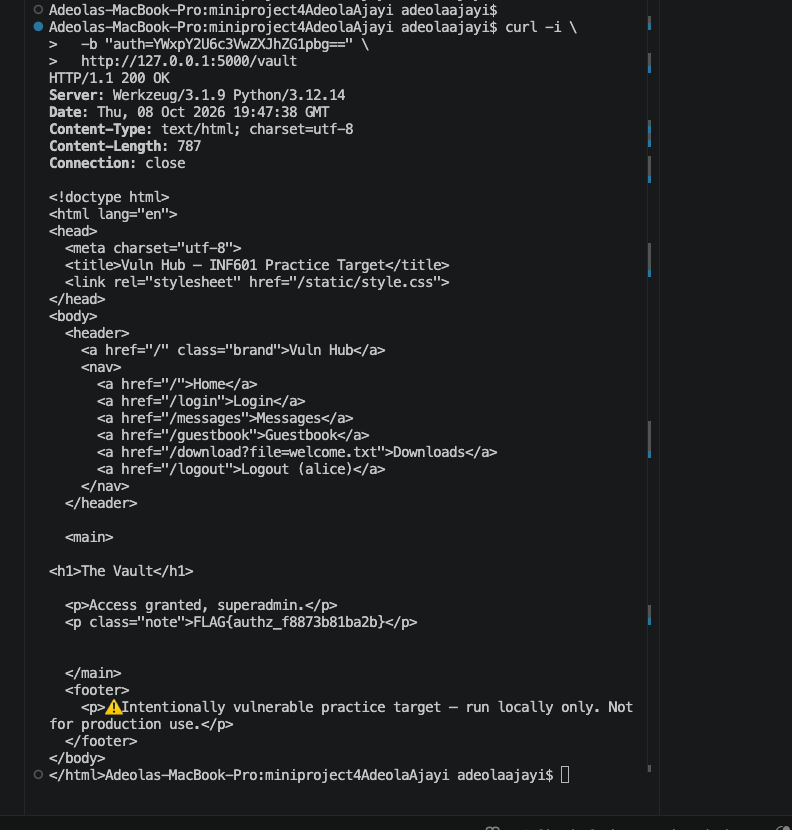

**Conclusion:** These tests demonstrate that the application trusts a client-controlled authentication cookie when making authorization decisions. By modifying the cookie, a regular user can gain unauthorized superadmin access.

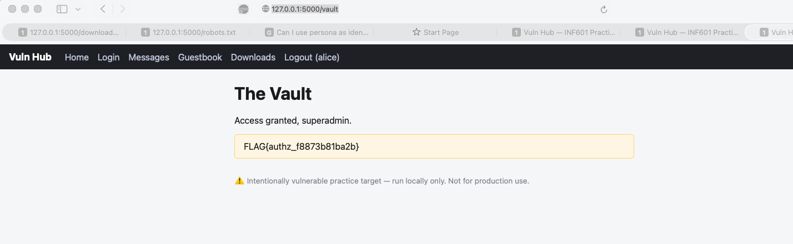

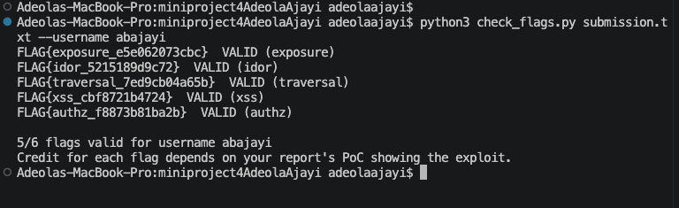

**Remediation:** Do not trust unsigned client-controlled data for authorization decisions. Store authorization roles securely on the server or use cryptographically signed session tokens that cannot be modified without detection. The server should independently verify the authenticated user's privileges before granting access to restricted resources.


## Finding 6: SQL Injection in the Login Form

**Severity:** Critical

**Description:** The login form constructs a SQL query using user-supplied username and password values without parameterized queries. This allows a user to inject SQL syntax into the username field and bypass normal authentication.

**Proof of Concept:**
1. Opened the application login page.
2. Entered the following value in the Username field:
   `' OR 1=1 -- `
3. Entered a value in the Password field and clicked **Sign in**.
4. The injected SQL condition evaluated as true and bypassed the normal username and password validation.
5. The application authenticated the session as `admin` and displayed the flag:
   `FLAG{sqli_6560eba165a5}`
6. Validated the captured flag using `check_flags.py`, resulting in `6/6 flags valid`.

**Impact:** An attacker could bypass authentication without knowing a valid user's password. Depending on the account returned by the database query, this could provide unauthorized access to sensitive information and privileged application functionality.

**Evidence:**
The screenshots below demonstrate successful authentication bypass through SQL injection in the login form. The application granted access to the administrator dashboard without a valid password and displayed the captured SQL injection flag. The terminal screenshot confirms that all six captured flags were successfully validated using check_flags.py, resulting in 6/6 valid flags.

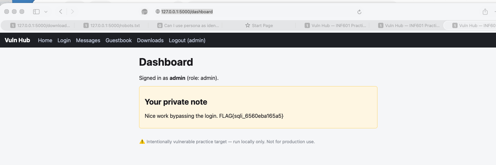

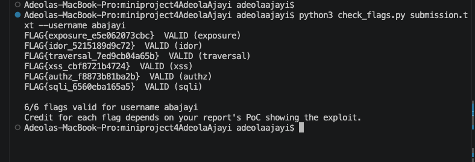


### Additional HTTP Proof-of-Concept Evidence

To further verify the SQL injection vulnerability, I performed two HTTP tests against the locally running Vuln Hub application using `curl`.

**Test 1: SQL injection login request**

I submitted a SQL injection payload through the username field using an HTTP POST request.

**Command:**

```bash
curl -i -c /tmp/vulnhub-sqli-cookies.txt \
  --data-urlencode "username=' OR 1=1 -- " \
  --data-urlencode "password=test123" \
  http://127.0.0.1:5000/login
```

**Result:** The application returned `HTTP/1.1 302 FOUND` with `Location: /dashboard` and issued an authentication cookie. This indicated that the login request was accepted.

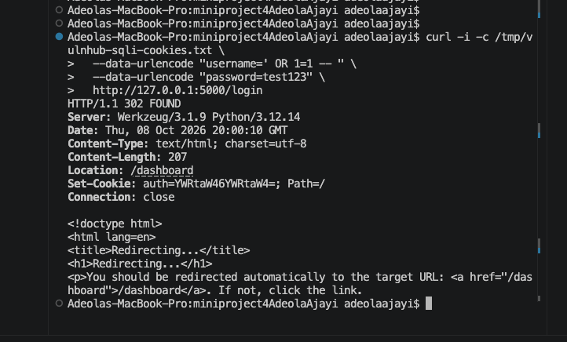

**Test 2: Verify administrator access**

I used the authentication cookie obtained from the SQL injection request to access the dashboard.

**Command:**

```bash
curl -i -b /tmp/vulnhub-sqli-cookies.txt \
  http://127.0.0.1:5000/dashboard
```

**Result:** The application returned `HTTP/1.1 200 OK` and displayed `Signed in as admin (role: admin)`, along with the SQL injection flag. This confirmed that the SQL injection bypassed normal authentication and granted administrator access.

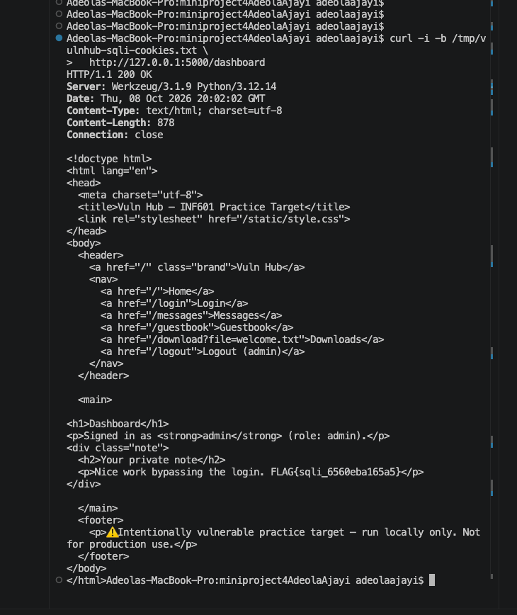

**Conclusion:** Both HTTP tests confirmed that the login form is vulnerable to SQL injection. The application accepted a manipulated username, bypassed password verification, and granted unauthorized administrator access.


**Remediation:** Use parameterized SQL queries instead of directly concatenating user input into SQL statements. Authentication should also securely validate credentials and follow the principle of least privilege.


## Conclusion

This penetration test was conducted in a local lab environment using the instructor-provided Vuln Hub application. During testing, I identified and successfully demonstrated six security vulnerabilities: exposed database backup, insecure direct object reference (IDOR), path traversal, stored cross-site scripting (XSS), broken authorization, and SQL injection.

All six vulnerabilities were documented with proof-of-concept steps, screenshots, impact assessments, and remediation recommendations. I also verified all six captured flags using `check_flags.py`, which confirmed that 6/6 flags were valid.

The findings demonstrate the importance of protecting sensitive files, enforcing proper access controls, validating user input, and securing authentication mechanisms. Applying the recommended security measures would help reduce the risk of unauthorized access and protect sensitive application data.
